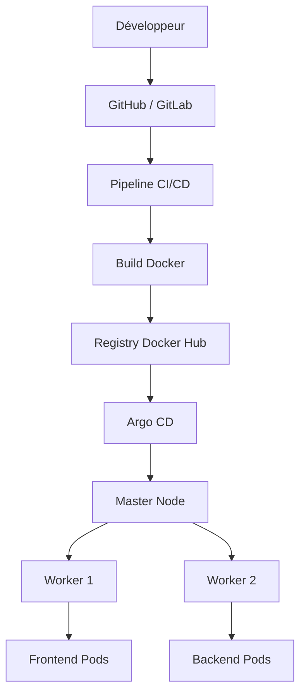
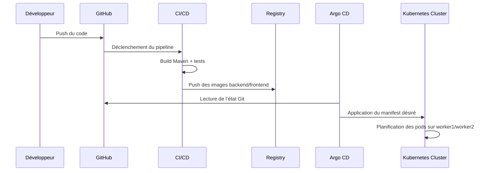
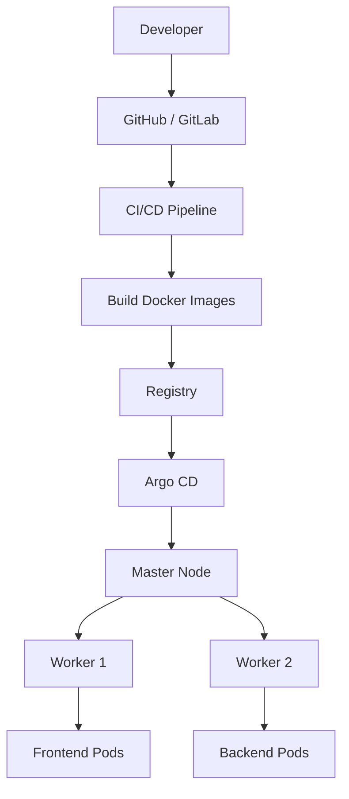
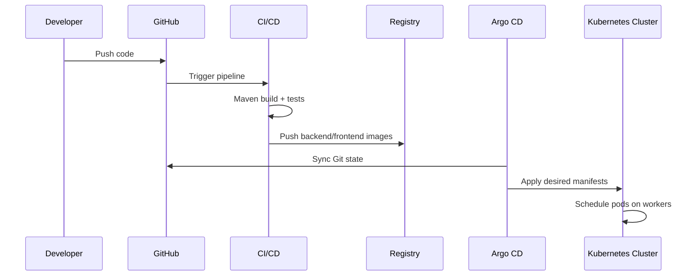

# Kubernetes CI/CD & GitOps Deployment


A production-oriented DevOps project demonstrating a complete CI/CD pipeline, containerization, and GitOps deployment on a Kubernetes cluster composed of one master node and two worker nodes.

## Table of Contents

- [Français](#français)
- [English](#english)

---

## Français

### Objectif du projet

Ce projet illustre le cycle de vie complet d’une application moderne dans un environnement Kubernetes réel :

- développement du code,
- validation automatisée via CI,
- construction des images Docker,
- publication dans un registre d’images,
- déploiement sur Kubernetes,
- synchronisation dynamique avec Argo CD,
- gestion du cluster avec `master`, `worker1` et `worker2`.

### Architecture du cluster Kubernetes

L’environnement fonctionnel est structuré comme suit :

- 1 nœud `master`
- 2 nœuds `worker1` et `worker2`
- les charges de travail sont planifiées sur les workers,
- le master gère l’orchestration et le contrôle du cluster,
- les services sont exposés localement ou via NodePort selon le besoin.



### Flux de déploiement dynamique



### Stack technique

- Java 21
- Spring Boot 3
- Maven
- HTML / JavaScript
- nginx
- Docker
- Kubernetes
- kubectl
- GitHub Actions / Jenkins
- Argo CD
- Docker Hub ou GHCR

### Fonctionnalités

- API REST pour gérer une liste de tâches,
- frontend interactif en JavaScript,
- déploiement multi-pods sur Kubernetes,
- orchestration avec `master` + `worker1` + `worker2`,
- travail GitOps avec Argo CD,
- automatisation CI/CD pour build et release.

### Structure du dépôt

```text
k8s-demo-app/
├── backend/
│   ├── Dockerfile
│   ├── pom.xml
│   └── src/
│       └── main/
│           ├── java/
│           └── resources/
├── frontend/
│   ├── Dockerfile
│   ├── app.js
│   ├── default.conf
│   ├── index.html
│   └── style.css
├── k8s/
│   ├── backend.yaml
│   ├── frontend.yaml
│   └── namespace.yaml
├── .github/
│   └── workflows/
│       └── ci-cd.yml
├── .gitignore
├── deploy.sh
├── README.md
└── LICENSE
```

### Workflow CI/CD

#### Déclenchement

Le pipeline démarre automatiquement lors d’un push sur les branches principales, par exemple :

- `main` pour la production,
- `dev` pour le développement et la validation,
- `feature/*` pour les fonctionnalités isolées.

#### Étapes classiques

1. récupération du code source,
2. build backend avec Maven,
3. exécution des tests,
4. build des images Docker,
5. publication dans le registry,
6. mise à jour des manifests si nécessaire,
7. synchronisation par Argo CD,
8. vérification du rollout Kubernetes.

### Argo CD et GitOps

Argo CD permet de déployer selon une logique GitOps, où Git est la source de vérité.

- les manifests Kubernetes sont versionnés dans Git,
- Argo CD observe le dépôt,
- il applique automatiquement l’état souhaité sur le cluster,
- le cluster converge vers l’état décrit dans Git.

Un exemple de manifest `Application` Argo CD est disponible dans [k8s/argocd-application.yaml](k8s/argocd-application.yaml). Il pointe vers le dossier `k8s/` du dépôt, applique l’état souhaité dans le namespace `demo-app`, et restaure automatiquement les changements via `selfHeal`.

### Déploiement Kubernetes

```powershell
kubectl apply -f k8s/namespace.yaml
kubectl apply -f k8s/backend.yaml
kubectl apply -f k8s/frontend.yaml
kubectl apply -f k8s/argocd-application.yaml
```

### Vérification

```powershell
kubectl -n demo-app get pods,svc
kubectl get nodes
kubectl get pods -A
```

### Accès à l’application

Le frontend est exposé via NodePort sur le port `30080` :

```text
http://<IP_PUBLIC_DU_NOEUD>:30080
```

### API backend

| Méthode | Endpoint | Description |
|---|---|---|
| `GET` | `/api/hello` | Message de santé du pod |
| `GET` | `/api/tasks` | Liste des tâches |
| `POST` | `/api/tasks` | Ajoute une tâche |
| `PUT` | `/api/tasks/{id}/toggle` | Change l’état d’une tâche |
| `DELETE` | `/api/tasks/{id}` | Supprime une tâche |

### Bonnes pratiques DevOps

- séparer les branches `dev` et `main`,
- utiliser des tags d’images explicites,
- sécuriser les secrets Kubernetes,
- surveiller les ressources et les pods,
- faire confiance à Argo CD pour la continuité GitOps.

---

## English

### Project objective

This project illustrates the complete lifecycle of a modern application in a real Kubernetes environment:

- source code development,
- automated validation through CI,
- Docker image building,
- publishing to a container registry,
- deployment on Kubernetes,
- dynamic synchronization with Argo CD,
- cluster management using `master`, `worker1`, and `worker2`.

### Kubernetes cluster architecture

The functional environment is structured as follows:

- 1 control plane node: `master`
- 2 worker nodes: `worker1` and `worker2`
- workloads are scheduled on the workers,
- the master manages orchestration and cluster control,
- services are exposed internally or through NodePort depending on the need.



### Dynamic deployment flow



### Tech stack

- Java 21
- Spring Boot 3
- Maven
- HTML / JavaScript
- nginx
- Docker
- Kubernetes
- kubectl
- GitHub Actions / Jenkins
- Argo CD
- Docker Hub or GHCR

### Functional scope

- REST API for task management,
- interactive frontend in JavaScript,
- multi-pod deployment on Kubernetes,
- orchestration across `master` + `worker1` + `worker2`,
- GitOps deployment with Argo CD,
- CI/CD automation for build and release processes.

### CI/CD workflow

#### Trigger

The pipeline runs automatically on pushes to the main branches, for example:

- `main` for production,
- `dev` for development and validation,
- `feature/*` for isolated feature work.

#### Typical stages

1. source checkout,
2. Java backend build with Maven,
3. tests execution,
4. Docker image creation,
5. image push to registry,
6. manifest update if needed,
7. Argo CD synchronization,
8. Kubernetes rollout verification.

### Argo CD and GitOps

Argo CD is used to reconcile the cluster with the desired state declared in Git.

- Git is the source of truth,
- manifests are versioned and auditable,
- Argo CD continuously watches the repository,
- deployment changes are applied automatically,
- the cluster converges toward the desired configuration.

A ready-to-use Argo CD `Application` manifest is available in [k8s/argocd-application.yaml](k8s/argocd-application.yaml). It watches the `k8s/` folder, deploys into the `demo-app` namespace, and automatically reconciles drift through `selfHeal`.

### Kubernetes deployment

```powershell
kubectl apply -f k8s/namespace.yaml
kubectl apply -f k8s/backend.yaml
kubectl apply -f k8s/frontend.yaml
kubectl apply -f k8s/argocd-application.yaml
```

### Verification

```powershell
kubectl -n demo-app get pods,svc
kubectl get nodes
kubectl get pods -A
```

### Application access

The frontend is exposed through NodePort on port `30080`:

```text
http://<PUBLIC_NODE_IP>:30080
```

### API reference

| Method | Endpoint | Description |
|---|---|---|
| `GET` | `/api/hello` | Health message from the pod |
| `GET` | `/api/tasks` | Lists all tasks |
| `POST` | `/api/tasks` | Creates a task |
| `PUT` | `/api/tasks/{id}/toggle` | Toggles task status |
| `DELETE` | `/api/tasks/{id}` | Deletes a task |

### Best practices

- isolate `dev` and `main` branches,
- use explicit image tags,
- secure Kubernetes secrets,
- monitor pod health and cluster resources,
- rely on Argo CD for a clean GitOps workflow.

---

## Author

Najeh TOUMI
