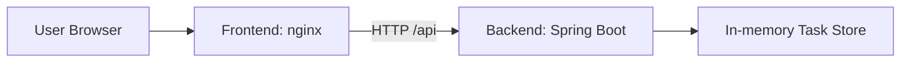

# Kubernetes To-Do Application


A portfolio-grade DevOps project demonstrating how to build, containerize, and deploy a full web application on Kubernetes.

## About This Project

This repository showcases a practical Kubernetes deployment workflow using a simple to-do application composed of:

- a Java Spring Boot backend,
- a static frontend served by nginx,
- Docker images for both services,
- Kubernetes manifests for deployment and service exposure,
- an Azure-compatible cluster configuration.

The project is designed to highlight clean containerization, API communication, and orchestration patterns used in real-world cloud environments.

## Architecture



## Stack

- Java 21
- Spring Boot 3
- Maven
- HTML / JavaScript
- nginx
- Docker
- Kubernetes
- kubectl
- Azure Kubernetes deployment pattern

## Core Features

- Add a task
- Delete a task
- Toggle task completion status
- View all tasks
- Health endpoint `/api/hello`
- Deployable multi-pod configuration
- NodePort service exposure

## Repository Structure

```text
k8s-demo-app/
├── backend/
│   ├── Dockerfile
│   ├── pom.xml
│   └── src/
│       └── main/
│           ├── java/
│           └── resources/
├── frontend/
│   ├── Dockerfile
│   ├── app.js
│   ├── default.conf
│   ├── index.html
│   └── style.css
├── k8s/
│   ├── backend.yaml
│   ├── frontend.yaml
│   └── namespace.yaml
├── deploy.sh
├── README.md
├── .gitignore
└── LICENSE
```

## Prerequisites

Make sure the following are available on your machine:

- Docker Desktop
- A Docker Hub account or another registry
- A Kubernetes cluster reachable with `kubectl`
- A valid `kubeconfig` file

## Local Development

### 1. Start the backend

```powershell
cd backend
./mvnw spring-boot:run
```

### 2. Start the frontend

```powershell
cd frontend
python -m http.server 8000
```

Then open:

```text
http://localhost:8000
```

## Container Build

Update the image tag with your Docker Hub username:

```powershell
docker login

docker build -t TON_USER_DOCKERHUB/k8s-demo-backend:1.0 ./backend
docker push TON_USER_DOCKERHUB/k8s-demo-backend:1.0

docker build -t TON_USER_DOCKERHUB/k8s-demo-frontend:1.0 ./frontend
docker push TON_USER_DOCKERHUB/k8s-demo-frontend:1.0
```

## Kubernetes Deployment

Update the manifests under `k8s/` to use your registry and image names.

Example:

```yaml
image: TON_USER_DOCKERHUB/k8s-demo-backend:1.0
```

Apply the resources:

```powershell
kubectl --kubeconfig=..\terraform-k8s-azure-v2\kubeconfig apply -f k8s/namespace.yaml
kubectl --kubeconfig=..\terraform-k8s-azure-v2\kubeconfig apply -f k8s/backend.yaml
kubectl --kubeconfig=..\terraform-k8s-azure-v2\kubeconfig apply -f k8s/frontend.yaml
```

## Verification

```powershell
kubectl --kubeconfig=..\terraform-k8s-azure-v2\kubeconfig -n demo-app get pods,svc
```

Check that both `backend-*` and `frontend-*` pods are in `Running` state.

## Access the Application

The frontend is exposed with a `NodePort` on port `30080`.

Open the following URL in a browser:

```text
http://<PUBLIC_NODE_IP>:30080
```

## API Reference

| Method | Endpoint | Description |
|---|---|---|
| `GET` | `/api/hello` | Returns a pod health message |
| `GET` | `/api/tasks` | Lists all tasks |
| `POST` | `/api/tasks` | Creates a task |
| `PUT` | `/api/tasks/{id}/toggle` | Toggles task state |
| `DELETE` | `/api/tasks/{id}` | Removes a task |

## Update Workflow

After changing the code:

1. rebuild the affected image,
2. push the new image,
3. rollout the Kubernetes deployment.

Example:

```powershell
kubectl --kubeconfig=..\terraform-k8s-azure-v2\kubeconfig rollout restart deployment/backend -n demo-app
kubectl --kubeconfig=..\terraform-k8s-azure-v2\kubeconfig rollout restart deployment/frontend -n demo-app
```

## Troubleshooting

### Frontend cannot reach backend

Check:

- `backend-svc` exists,
- backend port is `8080`,
- pods are healthy,
- nginx is configured to route API requests correctly.

### Docker build fails

Verify:

- Docker Desktop is running,
- the Dockerfiles are present,
- the build context is correct.

### Kubernetes fails to schedule workloads

Verify:

- the `kubeconfig` file is valid,
- the `demo-app` namespace exists,
- the cluster resources are healthy.

## Project Status

This project is intended for learning, portfolio demonstration, and Kubernetes practice in a real-world environment.

## Author

Najeh TOUMI
