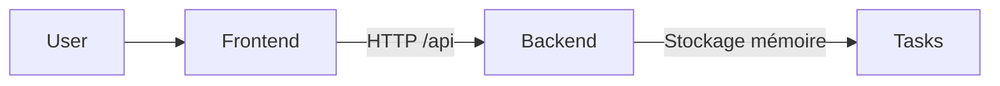

# Démo K8s : To-Do List


Application de démonstration pour illustrer le déploiement d’une architecture web complète sur Kubernetes, avec un backend Java Spring Boot et un frontend JavaScript servi par nginx.

## Vue d’ensemble

Cette application contient :

- un backend REST pour gérer une liste de tâches,
- un frontend statique qui consomme l’API,
- des manifests Kubernetes pour le déploiement,
- une configuration Docker pour la conteneurisation.



## Stack technique

- Java 21
- Spring Boot
- Maven
- HTML + JavaScript
- nginx
- Docker
- Kubernetes
- kubectl

## Fonctionnalités

- ajout d’une tâche,
- suppression d’une tâche,
- validation d’une tâche,
- lecture de la liste des tâches,
- endpoint de santé `/api/hello`,
- déploiement multi-pods sur Kubernetes,
- exposition via `NodePort`.

## Structure du projet

```text
k8s-demo-app/
├── backend/
│   ├── Dockerfile
│   ├── pom.xml
│   └── src/
│       └── main/
│           ├── java/
│           └── resources/
├── frontend/
│   ├── Dockerfile
│   ├── app.js
│   ├── default.conf
│   ├── index.html
│   └── style.css
├── k8s/
│   ├── backend.yaml
│   ├── frontend.yaml
│   └── namespace.yaml
├── deploy.sh
├── README.md
└── .gitignore
```

## Prérequis

Avant de lancer le projet, vérifie que tu as :

- Docker Desktop installé et démarré,
- un compte sur un registre d’images tel que Docker Hub,
- un cluster Kubernetes accessible via `kubectl`,
- un fichier `kubeconfig` valide.

## Démarrage rapide

### 1. Backend local

Depuis la racine du projet :

```powershell
cd backend
./mvnw spring-boot:run
```

L’API est alors accessible sur :

```text
http://localhost:8080
```

### 2. Frontend local

Ouvre le projet directement dans le navigateur ou démarre un mini serveur local :

```powershell
cd frontend
python -m http.server 8000
```

Puis ouvre :

```text
http://localhost:8000
```

## Build et publication des images Docker

Depuis la racine du projet, remplace `TON_USER_DOCKERHUB` par ton identifiant Docker Hub :

```powershell
docker login

docker build -t TON_USER_DOCKERHUB/k8s-demo-backend:1.0 ./backend
docker push TON_USER_DOCKERHUB/k8s-demo-backend:1.0

docker build -t TON_USER_DOCKERHUB/k8s-demo-frontend:1.0 ./frontend
docker push TON_USER_DOCKERHUB/k8s-demo-frontend:1.0
```

## Configuration des manifestes Kubernetes

Ouvre les fichiers dans `k8s/` et remplace l’image de référence par ton propre registre.

Exemple dans `k8s/backend.yaml` :

```yaml
image: TON_USER_DOCKERHUB/k8s-demo-backend:1.0
```

## Déploiement sur le cluster

Depuis la racine du projet :

```powershell
kubectl --kubeconfig=..\terraform-k8s-azure-v2\kubeconfig apply -f k8s/namespace.yaml
kubectl --kubeconfig=..\terraform-k8s-azure-v2\kubeconfig apply -f k8s/backend.yaml
kubectl --kubeconfig=..\terraform-k8s-azure-v2\kubeconfig apply -f k8s/frontend.yaml
```

> Adapte le chemin vers ton fichier `kubeconfig` selon ton environnement.

## Vérification du déploiement

```powershell
kubectl --kubeconfig=..\terraform-k8s-azure-v2\kubeconfig -n demo-app get pods,svc
```

Vérifie que les pods `backend-*` et `frontend-*` sont bien en `Running`.

## Accès à l’application

Le frontend est exposé via un service `NodePort` sur le port `30080`.

Dans le navigateur, ouvre :

```text
http://<IP_PUBLIQUE_D_UN_NOEUD>:30080
```

## API backend

Le backend expose les endpoints suivants :

| Méthode | Endpoint | Description |
|---|---|---|
| `GET` | `/api/hello` | Renvoie un message de santé du pod |
| `GET` | `/api/tasks` | Récupère la liste des tâches |
| `POST` | `/api/tasks` | Ajoute une tâche |
| `PUT` | `/api/tasks/{id}/toggle` | Change l’état d’une tâche |
| `DELETE` | `/api/tasks/{id}` | Supprime une tâche |

## Mise à jour de l’application

Après modification du code :

1. rebuild l’image concernée,
2. push la nouvelle version,
3. redéployer la ressource Kubernetes.

Exemple :

```powershell
kubectl --kubeconfig=..\terraform-k8s-azure-v2\kubeconfig rollout restart deployment/backend -n demo-app
kubectl --kubeconfig=..\terraform-k8s-azure-v2\kubeconfig rollout restart deployment/frontend -n demo-app
```

## Dépannage

### Le frontend ne contacte pas le backend

Vérifie que :

- le service `backend-svc` existe,
- le port du backend est bien `8080`,
- les pods sont bien démarrés,
- le proxy nginx pointe vers le bon service interne.

### Les images Docker ne se construisent pas

Contrôle que :

- Docker Desktop est bien lancé,
- les fichiers `Dockerfile` existent,
- le contexte de build est correct.

### Le cluster ne démarre pas les workloads

Vérifie :

- la validité du `kubeconfig`,
- la présence du namespace `demo-app`,
- les événements Kubernetes avec `kubectl describe`.

## Licence

Projet de démonstration destiné à des fins pédagogiques et de formation.

## Auteur

Najeh TOUMI
