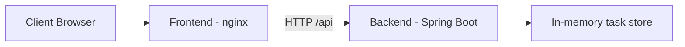

# Kubernetes To-Do App


A production-style demo application designed to showcase containerization and Kubernetes deployment using a Java backend and a static frontend.

## Overview

This project demonstrates how a small web application can be packaged with Docker and deployed in a Kubernetes cluster. It includes:

- a Java Spring Boot backend exposing REST APIs,
- a frontend built with HTML and JavaScript,
- nginx as the frontend web server,
- Kubernetes manifests to deploy both services,
- an Azure-based deployment pattern using a kubeconfig.

## Architecture



## Tech Stack

- Java 21
- Spring Boot
- Maven
- JavaScript / HTML
- nginx
- Docker
- Kubernetes
- kubectl

## Features

- Create tasks
- Delete tasks
- Mark tasks as done
- List all tasks
- Health endpoint `/api/hello`
- Multi-pod Kubernetes deployment
- NodePort access for external traffic

## Project Structure

```text
k8s-demo-app/
├── backend/
│   ├── Dockerfile
│   ├── pom.xml
│   └── src/
│       └── main/
│           ├── java/
│           └── resources/
├── frontend/
│   ├── Dockerfile
│   ├── app.js
│   ├── default.conf
│   ├── index.html
│   └── style.css
├── k8s/
│   ├── backend.yaml
│   ├── frontend.yaml
│   └── namespace.yaml
├── deploy.sh
├── README.md
├── .gitignore
└── LICENSE
```

## Prerequisites

Before running the project, make sure you have:

- Docker Desktop installed and running,
- a Docker Hub account or another container registry,
- a Kubernetes cluster and valid `kubectl` access,
- a working `kubeconfig` file.

## Quick Start

### 1. Run the backend locally

```powershell
cd backend
./mvnw spring-boot:run
```

The API will be available at:

```text
http://localhost:8080
```

### 2. Run the frontend locally

```powershell
cd frontend
python -m http.server 8000
```

Open:

```text
http://localhost:8000
```

## Docker Build and Push

Replace `TON_USER_DOCKERHUB` with your Docker Hub username:

```powershell
docker login

docker build -t TON_USER_DOCKERHUB/k8s-demo-backend:1.0 ./backend
docker push TON_USER_DOCKERHUB/k8s-demo-backend:1.0

docker build -t TON_USER_DOCKERHUB/k8s-demo-frontend:1.0 ./frontend
docker push TON_USER_DOCKERHUB/k8s-demo-frontend:1.0
```

## Kubernetes Deployment

Update the image references in the manifests under `k8s/`.

Example:

```yaml
image: TON_USER_DOCKERHUB/k8s-demo-backend:1.0
```

Then apply the manifests:

```powershell
kubectl --kubeconfig=..\terraform-k8s-azure-v2\kubeconfig apply -f k8s/namespace.yaml
kubectl --kubeconfig=..\terraform-k8s-azure-v2\kubeconfig apply -f k8s/backend.yaml
kubectl --kubeconfig=..\terraform-k8s-azure-v2\kubeconfig apply -f k8s/frontend.yaml
```

> Adjust the kubeconfig path to match your environment.

## Verify Deployment

```powershell
kubectl --kubeconfig=..\terraform-k8s-azure-v2\kubeconfig -n demo-app get pods,svc
```

You should see the `backend-*` and `frontend-*` pods in `Running` state.

## Access the Application

The frontend is exposed on NodePort `30080`.

Open in your browser:

```text
http://<PUBLIC_NODE_IP>:30080
```

## API Endpoints

| Method | Endpoint | Description |
|---|---|---|
| `GET` | `/api/hello` | Returns a health message |
| `GET` | `/api/tasks` | Lists tasks |
| `POST` | `/api/tasks` | Adds a task |
| `PUT` | `/api/tasks/{id}/toggle` | Toggles task status |
| `DELETE` | `/api/tasks/{id}` | Deletes a task |

## Rolling Updates

After modifying the app, rebuild and push the image, then restart the deployment.

```powershell
kubectl --kubeconfig=..\terraform-k8s-azure-v2\kubeconfig rollout restart deployment/backend -n demo-app
kubectl --kubeconfig=..\terraform-k8s-azure-v2\kubeconfig rollout restart deployment/frontend -n demo-app
```

## Troubleshooting

### Frontend cannot reach backend

Check:

- the service `backend-svc` exists,
- backend port `8080` is correct,
- pods are healthy,
- nginx proxy points to the correct internal service.

### Docker build fails

Verify:

- Docker Desktop is running,
- Dockerfiles are present,
- build context is correct.

### Kubernetes deployment issues

Verify:

- `kubeconfig` is valid,
- namespace `demo-app` exists,
- pods and events are healthy with `kubectl describe`.

## Project Status

This project is intended for learning, infrastructure demos, and Kubernetes hands-on practice.

## Author

Najeh TOUMI
