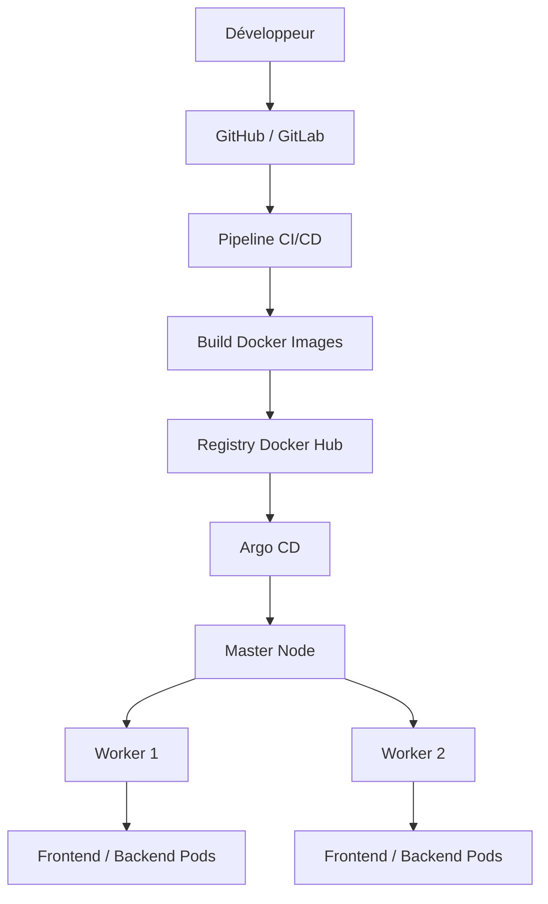
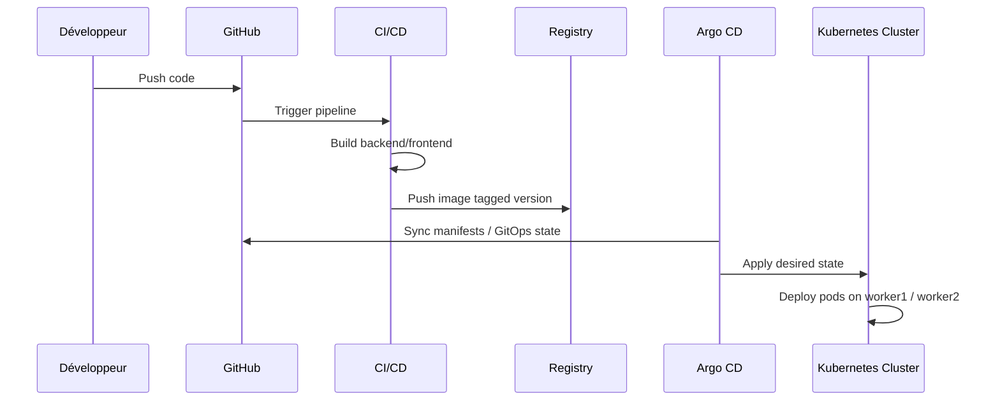

# Kubernetes CI/CD & Argo CD Demo


Application de démonstration DevOps pour illustrer un pipeline CI/CD complet avec Docker, Kubernetes et Argo CD, sur une architecture fonctionnelle composée d’un master et de deux workers.

## Objectif du projet

Ce projet montre comment automatiser le cycle de vie d’une application web moderne :

- développement du code,
- validation avec CI,
- construction des images Docker,
- publication dans un registre,
- déploiement sur Kubernetes,
- synchronisation dynamique via Argo CD,
- gestion du cluster avec un nœud master et deux nœuds workers.

## Architecture Kubernetes du cluster

Notre environnement fonctionnel est structuré comme suit :

- 1 nœud `master`
- 2 nœuds `worker1` et `worker2`
- les workloads sont planifiés sur les workers,
- le master gère l’orchestration et la gestion du cluster,
- les services sont exposés au niveau du cluster ou via NodePort selon le besoin.



## Flux dynamique de déploiement



## Stack technique

- Java 21
- Spring Boot
- Maven
- HTML / JavaScript
- nginx
- Docker
- Kubernetes
- kubectl
- GitHub Actions ou Jenkins
- Argo CD
- Docker Hub ou autre registry

## Fonctionnalités

- API REST pour la gestion d’une liste de tâches,
- frontend dynamique en JavaScript,
- déploiement multi-pods sur Kubernetes,
- orchestration avec master + worker1 + worker2,
- workflow GitOps via Argo CD,
- intégration CI/CD pour build et release automatisés.

## Structure du dépôt

```text
k8s-demo-app/
├── backend/
│   ├── Dockerfile
│   ├── pom.xml
│   └── src/
│       └── main/
│           ├── java/
│           └── resources/
├── frontend/
│   ├── Dockerfile
│   ├── app.js
│   ├── default.conf
│   ├── index.html
│   └── style.css
├── k8s/
│   ├── backend.yaml
│   ├── frontend.yaml
│   └── namespace.yaml
├── deploy.sh
├── README.md
├── .gitignore
└── LICENSE
```

## CI/CD workflow

### 1. Déclenchement

Le pipeline démarre automatiquement lors d’un push sur la branche cible, par exemple :

- `main` pour production,
- `dev` pour validation,
- `feature/*` pour développement.

### 2. Étapes typiques

1. Récupération du code source,
2. build backend Java avec Maven,
3. build frontend statique ou Docker image,
4. exécution de tests,
5. construction des images Docker,
6. push sur le registry,
7. mise à jour des manifestes si nécessaire,
8. synchronisation automatique par Argo CD.

### Exemples de jobs

```yaml
steps:
  - checkout
  - setup-java
  - mvn test
  - docker build -t repo/backend:latest ./backend
  - docker push repo/backend:latest
  - docker build -t repo/frontend:latest ./frontend
  - docker push repo/frontend:latest
```

## Argo CD

Argo CD permet un déploiement GitOps basé sur un dépôt Git comme source de vérité.

### Principe

- le code source et les manifests Kubernetes sont dans Git,
- Argo CD surveille le dépôt,
- dès qu’un changement est détecté, il applique automatiquement la configuration sur le cluster,
- les pods sont recréés ou mis à jour selon l’état souhaité.

### Cas d’usage ici

- le dépôt Git contient les manifests Kubernetes,
- Argo CD observe le cluster,
- les images sont versionnées,
- les services backend/frontend sont synchronisés en continu.

## Architecture applicative

```text
Client -> NGINX Frontend -> Backend API -> In-memory tasks
                             |
                             +-> Kubernetes Service
```

## Prérequis

Avant de déployer, vérifie que tu as :

- Docker Desktop installé,
- un registre d’images (Docker Hub, GHCR, ACR, etc.),
- un cluster Kubernetes fonctionnel,
- un kubeconfig valide,
- Argo CD installé et configuré,
- un dépôt Git accessible par le pipeline.

## Déploiement sur le cluster

### 1. Créer le namespace

```powershell
kubectl apply -f k8s/namespace.yaml
```

### 2. Déployer le backend

```powershell
kubectl apply -f k8s/backend.yaml
```

### 3. Déployer le frontend

```powershell
kubectl apply -f k8s/frontend.yaml
```

### 4. Vérifier les ressources

```powershell
kubectl -n demo-app get pods,svc
```

## Vérification du cluster fonctionnel

Pour un environnement avec master + worker1 + worker2 :

```powershell
kubectl get nodes
kubectl get pods -A
kubectl describe node master
kubectl describe node worker1
kubectl describe node worker2
```

Les pods doivent être planifiés sur les workers, tandis que le master gère le contrôle du cluster.

## Access to the application

Le frontend est exposé via `NodePort` sur le port `30080` :

```text
http://<IP_PUBLIC_DU_NOEUD>:30080
```

## API backend

| Méthode | Endpoint | Description |
|---|---|---|
| `GET` | `/api/hello` | Santé du service |
| `GET` | `/api/tasks` | Liste des tâches |
| `POST` | `/api/tasks` | Ajoute une tâche |
| `PUT` | `/api/tasks/{id}/toggle` | Change l’état de la tâche |
| `DELETE` | `/api/tasks/{id}` | Supprime une tâche |

## Exemple de pipeline CI/CD

```yaml
name: ci-cd

on:
  push:
    branches: [main, dev]

jobs:
  build:
    runs-on: ubuntu-latest
    steps:
      - uses: actions/checkout@v4
      - uses: actions/setup-java@v4
        with:
          distribution: temurin
          java-version: '21'
      - run: mvn -f backend/pom.xml test
      - run: docker build -t myregistry/k8s-demo-backend:latest ./backend
      - run: docker build -t myregistry/k8s-demo-frontend:latest ./frontend
      - run: docker push myregistry/k8s-demo-backend:latest
      - run: docker push myregistry/k8s-demo-frontend:latest
```

## Déploiement GitOps avec Argo CD

- le repository Git est la source unique de vérité,
- Argo CD applique les manifests Kubernetes,
- le cluster se synchronise automatiquement,
- les mises à jour passent par Git et non par action manuelle directe sur le cluster.

## Bonnes pratiques DevOps

- versionner les images avec tags explicites,
- séparer `dev` et `main`,
- utiliser des pipelines distincts pour validation et production,
- toujours surveiller les ressources Kubernetes,
- utiliser Argo CD pour une approche GitOps propre,
- gérer les secrets via Kubernetes Secrets ou vault externe.

## Résumé

Ce projet représente une démonstration complète de l’écosystème DevOps moderne :

- code source,
- CI/CD,
- conteneurisation,
- Kubernetes,
- Argo CD,
- cluster maître + workers,
- automatisation et scalabilité.

## Auteur

Najeh TOUMI
